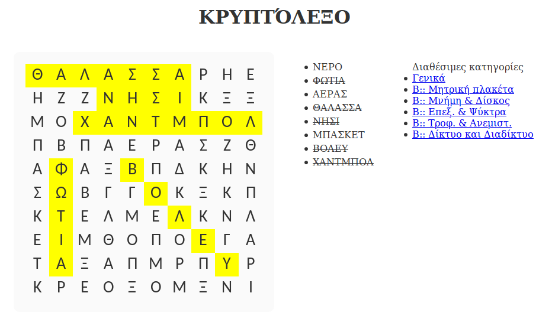

# Κρυπτόλεξο
Ένα παιχνίδι τύπου κρυπτόλεξο για εκπαιδευτική χρήση.
Είναι fork [αυτού](https://github.com/lizhineng/word-search-game) του παιχνιδιού.
Γραμμένο σε javascript. 

## Απαιτήσεις
**yarn instal**

## Εικόνα - Screenshot
 

## Online δοκιμή
Για να παίξεις το κρυπτόλεξο, πήγαινε σε [αυτή](http://www.sxoleio.pw/alx_code/word-search-game/) τη σελίδα.

## Παραμετροποίηση
Μέσα στο αρχείο [js/wordsearch.js](https://github.com/ale3andro/word-search-game/blob/master/js/wordsearch.js)  υπάρχει η μεταβλητή ***categories*** στην οποία μπορούν να παραμετροποιηθούν οι κατηγορίες (τροποποίηση/διαγραφή/προσθήκη κατηγοριών και λέξεων της κάθε κατηγορίας).

## Άδεια
Άδεια τύπου ΜΙΤ.

Αρχικός δημιουργός παιχνιδιού (c) 2013 Li Zhineng &lt;lizhineng@gmail.com&gt; and other `word-search-game` contributors

Permission is hereby granted, free of charge, to any person obtaining a copy of this software and associated documentation files (the "Software"), to deal in the Software without restriction, including without limitation the rights to use, copy, modify, merge, publish, distribute, sublicense, and/or sell copies of the Software, and to permit persons to whom the Software is furnished to do so, subject to the following conditions:

The above copyright notice and this permission notice shall be included in all copies or substantial portions of the Software.

THE SOFTWARE IS PROVIDED "AS IS", WITHOUT WARRANTY OF ANY KIND, EXPRESS OR IMPLIED, INCLUDING BUT NOT LIMITED TO THE WARRANTIES OF MERCHANTABILITY, FITNESS FOR A PARTICULAR PURPOSE AND NONINFRINGEMENT. IN NO EVENT SHALL THE AUTHORS OR COPYRIGHT HOLDERS BE LIABLE FOR ANY CLAIM, DAMAGES OR OTHER LIABILITY, WHETHER IN AN ACTION OF CONTRACT, TORT OR OTHERWISE, ARISING FROM, OUT OF OR IN CONNECTION WITH THE SOFTWARE OR THE USE OR OTHER DEALINGS IN THE SOFTWARE.